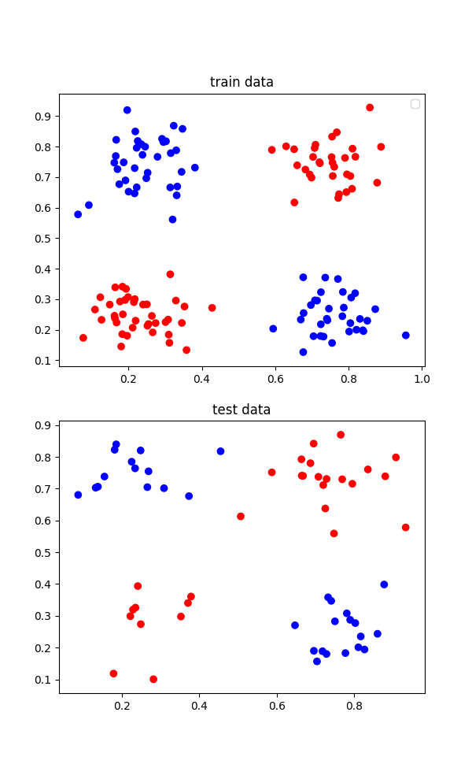
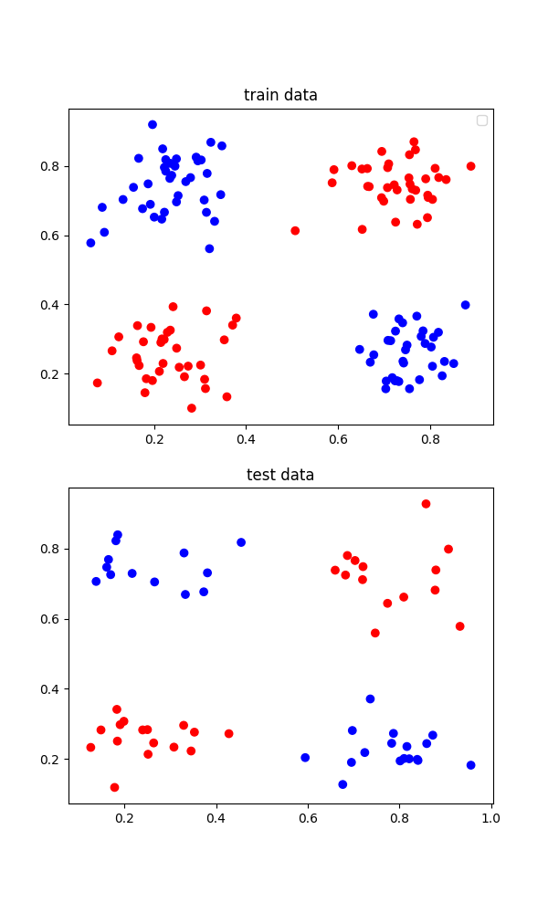
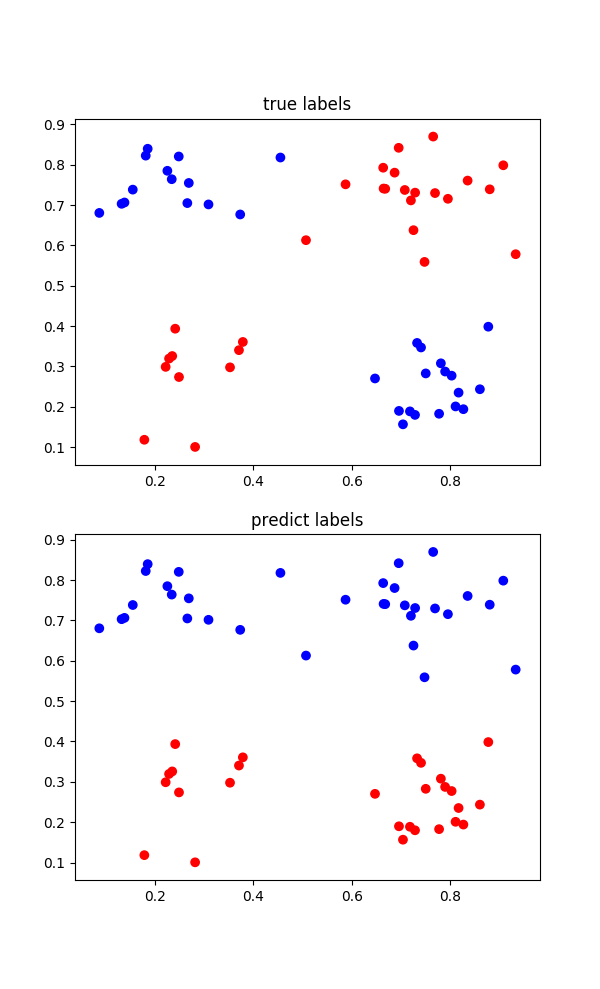
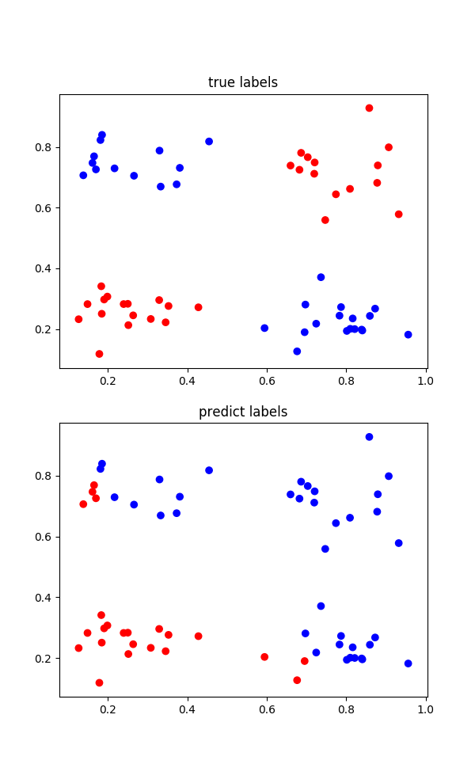
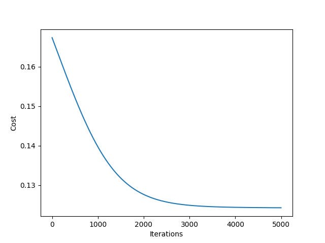
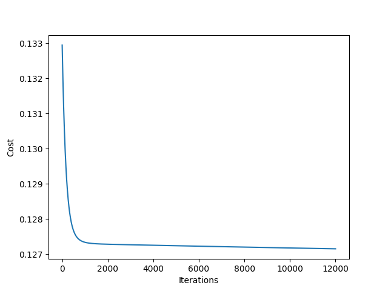

# Neural Network Optimization with Gradient Descent

## Overview
This project involves the implementation of a feedforward neural network optimized using the Gradient Descent algorithm. It demonstrates the training process through backpropagation and the application of the sigmoid activation function for binary classification tasks.

## Features
- Implementation of a feedforward neural network from scratch.
- Use of the Mean Squared Error (MSE) cost function for evaluating performance.
- Application of the sigmoid activation function in both the feedforward and backpropagation processes.
- Optimization using the Gradient Descent algorithm.

## Dataset
The dataset, split into training and testing sets, is used to train the neural network and evaluate its prediction accuracy.

## Training Process
The neural network is trained using the Gradient Descent optimization algorithm to adjust weights and minimize the cost function.

### Visualization of Training and Testing Data
- Training Data Points Separation:

- Testing Data Points Separation:


## Model Evaluation
After training, the model is evaluated on a test set. The visualization of true vs. predicted labels is used to assess the classification performance.

### True vs. Predicted Labels
- True Labels Visualization:

- Predicted Labels Visualization:


## Cost Function Analysis
The decrease in the cost function value over iterations during training is plotted to show the model's learning progress.

- Initial Cost Reduction Over Iterations:

- Refined Cost Reduction Over Iterations:


## Execution
Run the following commands to execute the training and evaluation of the neural network:

```bash
python tarmin1.py  # For the first neural network layer
python tarmin2.py  # For the two-layer network
